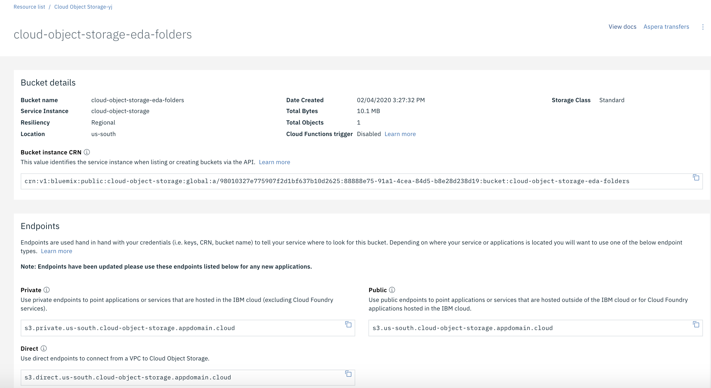
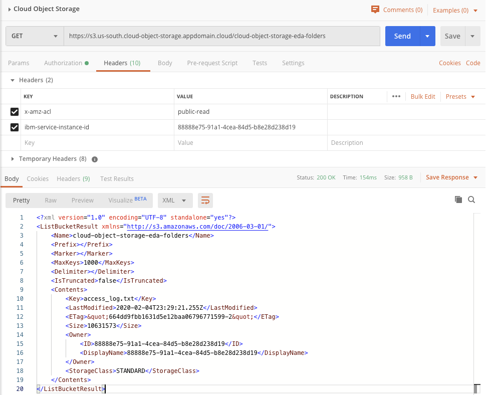

# IBM Cloud Object Storage

[IBM Cloud Object Storage](https://www.ibm.com/cloud/object-storage) is a cloud based storage for backup, application data files, persistence storage for analytics.

## Characteristics

* Cloud Object Storage is a multi-tenant system, and all instances of Object Storage share physical infrastructure
* Available with three types of resiliency: Cross Region (EU, AP, US), Regional (multiple availability one in a region), and Single Data Center (multiple servers)
* COS offers REST-based API for reading and writing objects: each storage location has its own set of URLs.
* `Bucket` is the container of the data and defines metadata about the storage: resiliency type, scale factor..



* All buckets in all regions across the globe share a single namespace.
* Bucket configuration defines role based (writer, reader, manager) to control access per user
* To get access to the content of a bucket using a application, define a `ServiceID`, under the bucket configuration and the `Access policies` to control the access rules, or link an existing service ID to the bucket.

## Access via CLI

* Login to IBM Cloud: `ibmcloud login -u .... --sso`
* Install cloud object storage plugin if not done before, or if you need to update existing version: `ibmcloud plugin install cloud-object-storage`
* To use the COS plugin, we need to configure it with the region to use and the objectstore‘s unique number, known as a CRN. To get the CRN do the following command using the name of the COS service: `ibmcloud resource service-instance "Cloud Object Storage-yj"`

```
  Retrieving service instance Cloud Object Storage-yj in all resource groups under account Cloud Client Engagement Team's Account as boyerje@us.ibm.com...
    OK

    Name:                  Cloud Object Storage-yj   
    ID:                    crn:v1:bluemix:public:cloud-object-storage:global:a/98010327e7....   

```

* `ibmcloud cos config crn ` then enter the crn from previous command in the prompt.
* Get the list of buckets: `ibmcloud cos list-buckets`
* Creating a bucket (name needs to be globally unique): `ibmcloud cos create-bucket --bucket mybucket`

## Access via API

* Get the API bearer token

```shell
 export COS_ADMIN_TOKEN=`ibmcloud iam oauth-tokens | grep IAM | awk '{printf("%s", $4)}'`
```

* Get service instance ID (replace "Cloud Object Storage-yj" with your service instance name): `export COS_GUID=$(ibmcloud resource service-instance "Cloud Object Storage-yj" | grep GUID | awk '{printf("%s", $2)}')`

* Using curl to access the content of a bucket:

```shell
    curl https://s3.us-south.cloud-object-storage.appdomain.cloud/cloud-object-storage-eda-folders -H "Authorization: Bearer $COS_ADMIN_TOKEN"  -H "x-amz-acl: public-read" -H "ibm-service-instance-id: $COS_GUID"
```



* Download a file (like access_log.txt): `curl -X GET https://s3.us-south.cloud-object-storage.appdomain.cloud/cloud-object-storage-eda-folders/access_log.txt -H "Authorization: Bearer $COS_ADMIN_TOKEN"  -H "x-amz-acl: public-read" -H "ibm-service-instance-id: $COS_GUID"`
* Other [curl commands explanation](https://cloud.ibm.com/docs/services/cloud-object-storage/cli?topic=cloud-object-storage-curl).


## Fearther readings

* [Getting started](https://cloud.ibm.com/docs/cloud-object-storage?topic=cloud-object-storage-getting-started)
* [Analyze data faster using Spark and Cloud Object Storage tutorial](https://developer.ibm.com/technologies/object-storage/tutorials/analyze-data-faster-using-spark-and-ibm-cloud-object-storage-s3-vs-swift-api/)