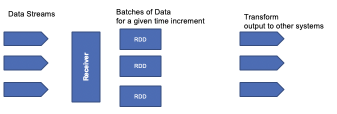

# Some getting started 

## RDD: Resilient Distributed Dataset

It is a dataset distributed against the cluster nodes. To create a RDD we use the spark context object and then one of it APIs depending of the data source (JDBC, Hive, HDFS, Cassandra, HBase, ElasticSearch, CSV, json,...):

```python
from pyspark import SparkConf, SparkContext

# get spark session
sparkConfiguration = SparkConf().setAppName("WorseMovie")
sparkSession = SparkContext(conf = sparkConfiguration)
# load movie ratings from a csv file as a RDD
lines = sparkSession.textFile('../data/movielens/u.data')
results = lines.take(10)
for result in results:
    print(result[0], result[1])
```

This program is not launched by using python interpreter by the `spark-submit` tool. This tool is available in the Dockerfile we defined, with a python 3.6 interpreter.

```
/spark/bin/spark-submit nameoftheprogram.py
```

Creating a RDD can be done from different data source, text file, csv, database, Hive, Cassandra ...

## Spark context

Created by the driver program, it is responsible for makng the RDD, resilient and distributed. Here is an example of a special context creation for Spark Streaming, using local server with one executor per core, and using a batch size of 1 second.

```scala
val scc = new StreamingContext("local[*]", "TelemetryAlarmer", Seconds(1))
```

## Transforming RDDs

Use Map, flatmap, filter, distinct, union, intersection, substract, ... functions, and then applies of one of action.

Nothing actually happens in your drive program until an action is called.

here is [an python API documentation](https://spark.apache.org/docs/latest/api/python/index.html).

In [this code](https://github.com/jbcodeforce/spark-studies/blob/master/src/SparkStreaming/SparkStreamingSamples/src/jbcodeforce/rdd/samples/wordscale.scala) there is a documented example of to use RDD to count word occurence in a text.
To be able to get an executor running the code, the scala program needs to be an object and have a main function:

```scala
object wordcount {
  
  def main(args: Array[String]) {
  }
}
```

Map transform one row into another row:

```scala
 // Now extract the text of each tweeter status update into DStreams:
 val statuses = tweets.map(status => status.getText())
```

while mapFlat transforms one row into multiple ones:

```scala
 // Blow out each word into a new DStream
    val tweetwords = statuses.flatMap(tweetText => tweetText.split(" "))
```

filter helps to remove row not matching a condition:

```scala
    // Now eliminate anything that's not a hashtag
    val hashtags = tweetwords.filter(word => word.startsWith("#"))
```

A classical transformation  it to create key value pair to count occurence of something like words using a reduce approach. reduce(f,l) applies the function f to elements of the list by pair: (i,j) where i is the result of f(i-1,j-1).


```scala
// Map each hashtag to a key/value pair of (hashtag, 1) so we can count them up by adding up the values
val hashtagKeyValues = hashtags.map(hashtag => (hashtag, 1))

val counts = hashtagKeyValues.reduceByKey()
```

## DataFrames

Spark 2.0 supports exposing data in RDD as data frames to apply SQL queries. DataFrames contain row Objects.

```python
from pyspark.sql import SparkSession
from pyspark.sql import Row
from pyspark.sql import functions

# Create a SparkSession 
spark = SparkSession.builder.appName("PopularMovies").getOrCreate()
lines = spark.sparkContext.textFile("../data/movielens/u.data")
# Convert it to a RDD of Row objects with (movieID, rating)
movies = lines.map(parseInput)
# Convert that to a DataFrame
movieDataset = spark.createDataFrame(movies)
```

## Spark Streaming

Big data never stops, so there is a need to continuously analyze data streams in real time. Some nice use cases: clickstream, real time sensor data from IoT. 



The RDD processing is distributed on different worker nodes to process data in parallel.

It also use the DStreams, or Discretized Streams, which is a continuous stream of data that receives input from various sources like Kafka, Flume, Kinesis, or TCP sockets.
DStreams is a collection of many RDD RDDs for each time step, and may produce output at each time step too. It acts as a RDD at the global level but we can also access the underlying RDDs. We can apply stateless transformations on Dstreams, like map, filter, reduceByKey... or we can use stateful data to maintain long-lived state. This is used for aggregate.

Stateless transformations are capable of combining data from many DStreams within each time step.

While Stateful transformation uses data or intermediate results from previous batches and computes the result of the current batch. They track data across time.

Spark streaming supports windowed transformation, to compute results across a longer time perido than your batch interval. Can be used for example to compute the total product sell over a 1 hour time window. The windows slides as time goes one, to represent batches within the window interval. 
In fact there are three intervals:

* the batch interval is how often data is captured into a DStream. it is specified when defining the spark streaming context. 
* the slide interval is how often a windowed transformation is computer
* the window interval is how far back in time the windowed transformation goes. 

To ensure fault tolerance incoming data is replicated to at least 3 worker nodes. For stateful operation, a checkpoint directory can be used to store states in case of failure and node restarts. 

The architecture of the receiver impacts the fault tolerance, for example if the receiver is a single point of failure. If a Twitter receiver fails, you loose data.

The drive code can be also a SPOF. But there are ways to design and implement a more reliable driver, by using StreamingContext.getOrCreate() API and use checkpoint directory on distributed filesystem, to be used when the driver restart, to pickup from the checkpoint directory.

### Environment setup

I used the Spark 3.0 preview 2 from december 2019 release within docker image, and Eclipse Scala IDE from [here](http://scala-ide.org/download/sdk.html). See also [some instructions from Sundog education](https://sundog-education.com/spark-streaming).

Running the code in Eclipse uses Spark jar files, so there is no connection to remote cluster.

See also [the explanations](http://jbcodeforce.github.io/spark-studies/#using-docker-compose) to run it with docker compose. 

### First streaming program

```scala
object PrintTweets {
  def main(args: Array[String]) {
       val ssc = new StreamingContext("local[*]", "PrintTweets", Seconds(1))
       // Create a DStream from Twitter using our streaming context
       val tweets = TwitterUtils.createStream(ssc, None)
        // Now extract the text of each status update into RDD's using map()
        val statuses = tweets.map(status => status.getText())
        // Print out the first ten
        statuses.print()
        // Kick it all off
        ssc.start()
        ssc.awaitTermination()
  }
```

### Assess the Tweeter popular Hashtags

The goal is to compute the most popular hashtag over a time window of 5 minutes and a slide interval of 1 seconds. See the solution in [PopularHashtags.scala]()

As seen previously, the approach is to get the tweet text, split it by words, and then generating key value pair for "(word, 1)" tuples, then use a specific reduce operation using time window:

```scala
// Map each hashtag to a key/value pair of (hashtag, 1) so we can count them up by adding up the values
val hashtagKeyValues = hashtags.map(hashtag => (hashtag, 1))
  
// Now count them up over a 5 minute window sliding every one second
val hashtagCounts = hashtagKeyValues.reduceByKeyAndWindow( (x,y) => x + y, (x,y) => x - y, Seconds(300), Seconds(1))
  
```