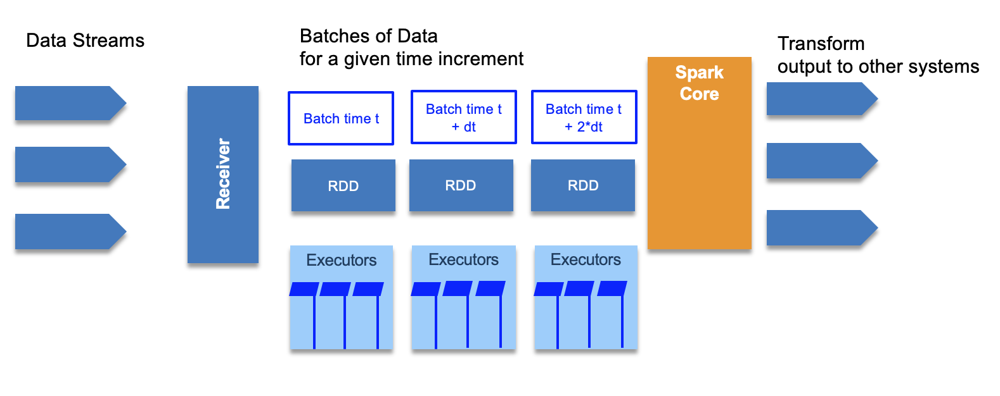

## Spark Streaming

Big data never stops, so there is a need to continuously analyze data streams in real time. Some nice use cases: clickstream, real time sensor data from IoT. 



The RDD processing is distributed on different worker nodes to process data in parallel.

It also use the **DStreams**, or Discretized Streams, which is a continuous stream of data that receives input from various sources like Kafka, Flume, Kinesis, or TCP sockets.
DStreams is a collection of many RDDs, one for each time step, and may produce output at each time step too. It acts as a RDD at the global level but we can also access the underlying RDDs. We can apply stateless transformations on Dstreams, like map, filter, reduceByKey... or we can use stateful data to maintain long-lived state. This is used for aggregate.

Stateless transformations are capable of combining data from many DStreams within each time step.

While Stateful transformation uses data or intermediate results from previous batches and computes the result of the current batch. They track data across time.

Spark streaming supports windowed transformation, to compute results across a longer time period than your batch interval. Can be used for example to compute the total product sell over a 1 hour time window. The windows slides as time goes one, to represent batches within the window interval.

In fact there are three intervals:

* the batch interval is how often data is captured into a DStream. It is specified when defining the spark streaming context.
* the slide interval is how often a windowed transformation is computed
* the window interval is how far back in time the windowed transformation goes.

To ensure fault tolerance incoming data is replicated to at least 3 worker nodes. For stateful operation, a checkpoint directory can be used to store states in case of failure and node restarts.

The architecture of the receiver impacts the fault tolerance, for example if the receiver is a single point of failure. If a Twitter receiver fails, you loose data.

The drive code can be also a SPOF. But there are ways to design and implement a more reliable driver, by using StreamingContext.getOrCreate() API and use checkpoint directory on distributed filesystem, to be used when the driver restarts, to pickup from the checkpoint directory.


### First streaming program

Print tweets from twitter feed. You need a twitter account and API access, then populate the credential in a twitter.txt file.

```
consumerKey Zk6zkTS..
consumerSecret WIyK..
accessToken 13...
accessTokenSecret VhT..
```

Then in scala define a function to load such credentials as properties

```scala
def setupTwitter() = {
    import scala.io.Source
    for (line <- Source.fromFile("../twitter.txt").getLines) {
      val fields = line.split(" ")
      if (fields.length == 2) {
        System.setProperty("twitter4j.oauth." + fields(0), fields(1))
      }
    }
  }
```

```scala
import org.apache.spark.streaming.twitter._

object PrintTweets {
  def main(args: Array[String]) {
       val ssc = new StreamingContext("local[*]", "PrintTweets", Seconds(1))
       // Create a DStream from Twitter using our streaming context
       val tweets = TwitterUtils.createStream(ssc, None)
        // Now extract the text of each status update into RDD's using map()
        val statuses = tweets.map(status => status.getText())
        // Print out the first ten
        statuses.print()
        // Kick it all off
        ssc.start()
        ssc.awaitTermination()
  }
```