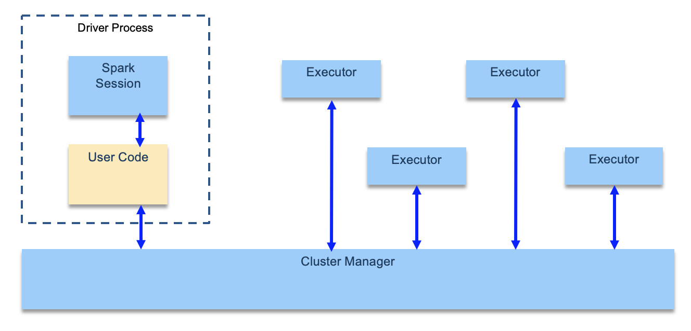

# Spark studies

Started at UC Berkeley in 2009.

The goal of Spark is to offer an **unified** platform for writing big data application: this means consistent APIs to do data loading, SQL, streaming, machine learning. It provides an unified engine for parallel data processing.

## Characteristics

* Data is expensive to move so Spark focuses on performing computations over the data, no matter where it resides
* provide a unified API for common data analysis tasks
* Spark includes libraries for SQL and structured data (Spark SQL), machine learning (MLlib), stream processing (Spark Streaming and the newer Structured Streaming), and graph analytics (GraphX)
* support large-scale machine learning using iterative algorithms that need to make multiple passes over the data.

## Concepts

* Spark Applications consist of a driver process and a set of executor processes. The driver process runs your main() function, sits on a node in the cluster, and is responsible for three things: 

        * maintaining information about the Spark Application
        * responding to a user’s program or input
        * analyzing, distributing, and scheduling work across the executors.

* each executor is responsible for only two things: executing code assigned to it by the driver, and reporting the state of the computation on that executor back to the driver node
* Spark employs a cluster manager that keeps track of the resources available

* There is a SparkSession object available to the user, which is the entry point to running Spark code