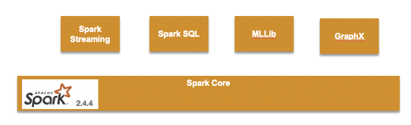

# Spark studies

Spark started at UC Berkeley in 2009, and it is one of the most adopted open source solution to run **parallel data processing** on distributed systems to process large-scale data.

The goal of Spark is to offer an **unified** platform for writing big data application: this means consistent APIs to do data loading, SQL, streaming, machine learning... 

## Characteristics

* Data is expensive to move so Spark focuses on performing computations over the data, no matter where they reside.
* Provide a unified API for common data analysis tasks: RDD and DataFrame (see in [this section](dev-on-spark.md))
* It provides a cluster with one `manager` node and multiple `executor` nodes. It can scale horizontally by adding executor nodes.
* Spark includes libraries for SQL and structured data (Spark SQL), machine learning (MLlib), stream processing (Spark Streaming and the newer Structured Streaming), and graph analytics (GraphX)



* Spark supports large-scale machine learning using iterative algorithms that need to make multiple passes over the data.
* It uses a directed acyclic graph, or DAG, to define the workflow to perform on the executor nodes. It is optimized by a DAG engine. Developers write code that is mapped to DAG for execution.
* Spark main data element is the Resilient Distributed Dataset (RDD), or in its newest version: the **Data frame**. RDD is an abstraction to manage distributed data in spark cluster.
* Spark is written in [Scala](scala_summary.md), and it is recommended to develop spark apps with Scala, even if Python is a viable soluton for POC and prototype.
* It is fast, 100x faster than hadoop Map Reduce.

## Architecture

* Spark Applications consist of a driver process and a set of executor processes. The driver process runs the main() function, sits on a node in the cluster, and is responsible for three things:

    * maintaining information about the Spark Application.
    * responding to a user’s program or input.
    * analyzing, distributing, and scheduling work across the executors.

* Each executor is responsible for only two things: executing code assigned to it by the driver, and reporting the state of the computation on that executor back to the driver node.
* Spark employs a cluster manager that keeps track of the resources available


* The main entry point for programming is the `SparkSession` object:

```python
spark = SparkSession.builder.appName("PopularMovies").getOrCreate()

lines = spark.sparkContext.textFile("../data/movielens/u.data")
```

See more development practices [here](dev-on-spark.md).

## Deployment

### Installation on k8s or openshift cluster

The spark driver runs as pod. The driver creates executors, which are also running within Kubernetes pods, connects to them and then executes application code.
The driver and executor pod scheduling is handled by Kubernetes.

See this [spark openshift deployment](https://jbcodeforce.github.io/openshift-studies/spark-on-os/#spark-on-openshift-using-operator) study.

The spark [product documentation](https://spark.apache.org/docs/latest/running-on-kubernetes.html) or use a [Spark operator](https://jbcodeforce.github.io/openshift-studies/spark-on-os/). The basic steps are:

1. Use a namespace like `jb-sparks`. Modify the cluster and operator yaml files to use this namespace.
1. Start the operator if it's not running

    ```bash
    oc apply -f k8s-operators/operator.yaml
    ```

1. Add cluster: edit the file `k8s-operators/cluster.yaml` to configure your number of workers

    ```bash
    oc apply -f k8s-operators/cluster.yaml
    ```

1. To verify the cluster runs do the following command on one of the worker pod to start a spark shell environment:

    ```bash
     oc get pods
     # select one of the work pod
     oc exec -ti my-spark-cluster-w-5pcqw  bash
     bash-4.2$ spark-shell
    ```

### Run locally with Docker

* 1st define docker network

When running locally define a network so the workers and master nodes can communicate together:

```shell
    docker network create spark_network
```

The Dockerfile, in this repository, is using a openjdk base image and install Spark 3.0.0. The commands to build the images and then start a spark container are:

```shell
    docker build -t jbcodeforce/spark .
    docker run --rm -it --name spark-master --hostname spark-master \
        -p 7077:7077 -p 8085:8085 --network spark_network jbcodeforce/spark bash
```

To simply validate the installation, use the `spark-shell` inside the docker container as:

```shell
bash-4.4# spark-shell

Using Scala version 2.12.10 (OpenJDK 64-Bit Server VM, Java 1.8.0_212)
Type in expressions to have them evaluated.
Type :help for more information.

scala> val rdd = sc.textFile("README.md")
rdd: org.apache.spark.rdd.RDD[String] = README.md MapPartitionsRDD[1] at textFile at <console>:24
scala> rdd.count()
```

* Start the Spark Master node:

Within the container run:

```shell
    /spark/bin/spark-class org.apache.spark.deploy.master.Master --ip `hostname` --port 7077 --webui-port 8085
    ....
    19/12/31 21:24:56 INFO Utils: Successfully started service 'MasterUI' on port 8085.
    19/12/31 21:24:56 INFO MasterWebUI: Bound MasterWebUI to 0.0.0.0, and started at http://a63a4db062fb:8085
    19/12/31 21:24:56 INFO Master: I have been elected leader! New state: ALIVE
```

* Access the Spark console

Simply go to: [http://localhost:8085/](http://localhost:8085/)

* Start a worker node, as a separate docker container

```shell
    docker run --rm -it --name spark-worker --hostname spark-worker \
        --network spark_network jbcodeforce/spark bash
```

then within the bash shell:

```shell
    /spark/bin/spark-class org.apache.spark.deploy.worker.Worker \
    --webui-port 8085 spark://spark-master:7077

    ...
    INFO Utils: Successfully started service 'sparkWorker' on port 45589.
    19/12/31 21:39:58 INFO Worker: Starting Spark worker 172.18.0.3:45589 with 3 cores, 4.8 GB RAM
    19/12/31 21:39:58 INFO Worker: Running Spark version 2.4.4
    19/12/31 21:39:58 INFO Worker: Spark home: /spark
    19/12/31 21:39:58 INFO Utils: Successfully started service 'WorkerUI' on port 8085.
    19/12/31 21:39:58 INFO WorkerWebUI: Bound WorkerWebUI to 0.0.0.0, and started at http://spark-worker:8085
    19/12/31 21:39:58 INFO Worker: Connecting to master spark-master:7077...
    19/12/31 21:39:58 INFO TransportClientFactory: Successfully created connection to spark-master/172.18.0.2:7077 after 75 ms (0 ms spent in bootstraps)
    19/12/31 21:39:59 INFO Worker: Successfully registered with master spark://spark-master:7077
```

On the Spark console we can see the worker added:


!!! Note
        The docker image includes one script to start the master and one to start the workers. The docker compose file uses those commands to propose a simple spark cluser with one worker and one master See [below](#using-docker-compose).

#### Smoke test the cluster

Start a 3nd container instance to run the `spark-submit` command to compute the value of Pi:

```shell
/spark/bin/spark-submit --master spark://spark-master:7077 --class     org.apache.spark.examples.SparkPi  /spark/examples/jars/spark-examples_2.11-2.4.4.jar 1000
```

### Using Docker Compose

To manage workers and master containers, the simplest approach is to use docker-compose. The docker compose file is in the root directory of this repository.

It uses two scripts to start the master or worker automatically. The environment variables to parameterize the WEB UI port, master node URL, and master port are set in the docker compose file. Start the cluster with 3 workers.

```shell
    docker-compose up --scale spark-worker=3

    spark-master    | 19/12/31 22:48:22 INFO Master: Registering worker 172.19.0.4:39193 with 3 cores, 4.8 GB RAM
    spark-master    | 19/12/31 22:48:22 INFO Master: Registering worker 172.19.0.3:39161 with 3 cores, 4.8 GB RAM
    spark-master    | 19/12/31 22:48:22 INFO Master: Registering worker 172.19.0.5:43775 with 3 cores, 4.8 GB RAM
    spark-worker_1  | 19/12/31 22:48:22 INFO Worker: Successfully registered with master spark://spark-master:7077
    spark-worker_3  | 19/12/31 22:48:22 INFO Worker: Successfully registered with master spark://spark-master:7077
    spark-worker_2  | 19/12/31 22:48:22 INFO Worker: Successfully registered with master spark://spark-master:7077
```

## Considerations

* Spark executors are not really cattle as they are keeping data partitions. So from a pure spark architecture, a kubernetes deployment, may look like an anti-pattern. RDD should help to compensate for pod failure.

## Run a sample python program

The most common way to launch spark applications on the cluster is to use the shell command `spark-submit`.

The source code [src/samples/FirstSparkProgram.py](https://github.com/jbcodeforce/spark-studies/tree/master/src/samples/FirstSparkProgram.py) that get the worse rated movie from the movie ratings in the `data` folder. To be able to run program as job on spark cluster we need to connect to the cluster and use spark-submit command. For that we are using another container instance, with the source code mounted to `/home`:

```shell
    docker run --rm -it --network spark_network -v $(pwd):/home jbcodeforce/spark bash
```

In the shell within this container runs:

```shell
bash-4.4# cd /home/src
bash-4.4# spark-submit samples/FirstSparkProgram.py

Amityville: Dollhouse (1996) 1.0
Somebody to Love (1994) 1.0
Every Other Weekend (1990) 1.0
Homage (1995) 1.0
3 Ninjas: High Noon At Mega Mountain (1998) 1.0
Bird of Prey (1996) 1.0
Power 98 (1995) 1.0
Beyond Bedlam (1993) 1.0
Falling in Love Again (1980) 1.0
T-Men (1947) 1.0
```

[Next step... develop on spark >>>](dev-on-spark.md)
