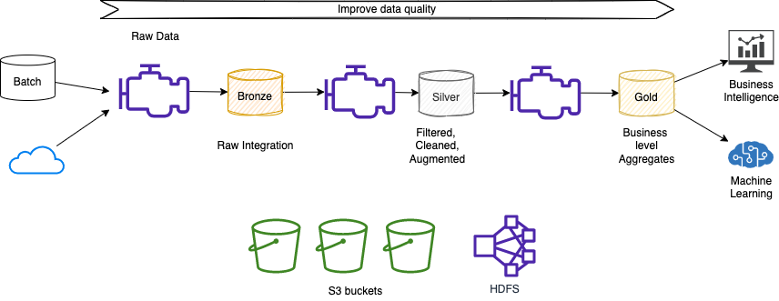
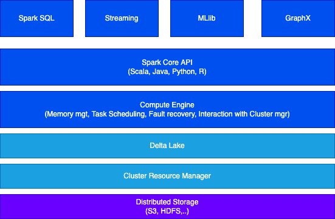

# Spark studies

!!!- "Update"
    Sept-05-2023

[Spark](https://spark.apache.org/) started at UC Berkeley in 2009, and it is one of the most adopted open source solution to run **parallel data processing** on distributed systems to process large-scale data.

The goal of Spark is to offer an **unified** platform for writing big data application: this means consistent APIs to do data loading, SQL, streaming, machine learning... 

From the business point of view, users often seek to extract meaningful insights from their data and convert it into a format that can be utilized by business intelligence applications or for training machine models. Sparks, in this context, serves as a valuable tool for constructing data pipelines that facilitate the transformation of raw data. These pipelines enable the filtering, cleansing, and augmentation of data sets, empowering them with analytics and business-level aggregates. Ultimately, this results in data sets that are readily consumable by various business applications.



The unified model for file system access is Hadoop FS.

The commercial version is supported by Databricks, but it is also available as managed services by cloud providers, such as AWS (via EMR).

Data Scientists use Python Pandas and scikit-learn to do most of their work on one computer, when the memory of one computer is not enough then Spark helps to process such big data. Pyspark is the Python API for Spark.

## Characteristics

Apache Spark boasts several key characteristics that make it a powerful tool for data analysis and big data workload processing.

1. **Data locality and computation**: Spark recognizes the costliness of moving data and focuses on performing computations directly on the data, regardless of its location. This approach minimizes unnecessary data transfers and enhances processing efficiency.

2. **Unified API for data analysis**: To simplify the development process, Spark provides a unified API that supports common data analysis tasks. Two primary abstractions, RDD (Resilient Distributed Dataset) and DataFrame, facilitate seamless data manipulation and transformation. You can explore more about these abstractions in [this section](dev-on-spark.md).

3. **Cluster-based architecture**: the architecture includes a single `manager` node and multiple `executor` nodes. By adding more executor nodes, Spark can horizontally scale, enabling efficient processing of large-scale datasets.

4. **RDD and DataFrames**: RDD, the main data element in Spark, acts as an abstraction for managing distributed data within the Spark cluster. Each dataset within an RDD is logically partitioned, allowing computations to be distributed across different cluster nodes. In the newest version of Spark, DataFrames provide a more structured and optimized approach for data manipulation.

5. **Comprehensive libraries**: Spark comes equipped with a range of libraries tailored to specific use cases. Spark SQL enables seamless querying and manipulation of structured data. MLlib empowers large-scale machine learning with support for iterative algorithms. Spark Streaming and Structured Streaming facilitate real-time and stream processing. Lastly, GraphX enables efficient graph analytics.

    { width=700 }

6. **Scalable machine learning**: Spark's architecture and distributed computing capabilities make it a powerful platform for large-scale machine learning. It efficiently handles iterative algorithms that require multiple passes over the data, enabling the processing of vast datasets with relative ease.

7. **Directed Acyclic Graph (DAG) execution model**: Spark utilizes a DAG to define the workflow of computations performed on the executor nodes. This workflow is optimized by a DAG engine, which ensures efficient execution. Developers write code that gets mapped to the DAG for seamless processing.

8. **Scala as the recommended language**: While Spark supports multiple programming languages, it is primarily written in [Scala](scala_summary.md). For the best performance and development experience, it is recommended to develop Spark applications using Scala. However, Python is a viable solution for proof-of-concepts (POCs) and prototyping.
9. **Exceptional performance**: Spark's in-memory processing and optimized execution engine contribute to its impressive speed. In fact, Spark is known to be up to 100 times faster than Hadoop MapReduce, making it an ideal choice for demanding big data workloads.

## Architecture

* Spark Applications consist of a driver process and a set of executor processes. The driver process runs the `main()` function, sits on a node in the cluster, and is responsible for three things:

    * maintain information about the Spark Application.
    * respond to a user’s program or input.
    * analyze, distribute, and schedule work across the executors.

* Each executor is responsible for only two things: executing code assigned to it by the driver, and reporting the state of the computation on that executor back to the driver node.

{ width=700 }

* The main entry point for programming is the `SparkSession` object:

```python
spark = SparkSession.builder.appName("PopularMovies").getOrCreate()

lines = spark.sparkContext.textFile("../data/movielens/u.data")
```

See more development practices [in this other article](./dev/index.md).

### Extended architecture

The full architecture includes distributed storage using data lake technology and the [**Delta Lake**](https://www.databricks.com/resources/ebook/delta-lake-running-oreilly) protocol which is an intermediate layer between Spark and storage to add services like ACID transaction and metadata about the object in the data lake. Spark job uses the Delta Lake to read and write data. 

{ width=600 }

??? info "Delta Lake"
    Delta Lake is an open-source storage layer that is designed to bring reliability and scalability to big data processing. It provides ACID transactional capabilities to data lakes.

    1. **Reliability**: Delta Lake ensures data integrity and reliability by providing ACID transactions, which means that multiple concurrent readers and writers can access the data without conflicts or inconsistencies. It also offers schema enforcement to prevent data corruption.

    2. **Scalability**: Delta Lake leverages the distributed processing power of Apache Spark to handle large-scale data processing. It supports parallel processing, enabling efficient execution of queries on massive datasets.

    3. **Data versioning**: Delta Lake maintains a full history of all changes made to the data, allowing you to track and query data at any point in time. This feature is particularly useful for auditing and compliance purposes.

    4. **Time travel**: Delta Lake enables you to query data as it existed at a specific point in time, making it easy to revert to previous versions or analyze data changes over time. It provides a simple syntax to perform time travel queries without the need for complex data restoration processes.

    5. **Schema evolution**: Delta Lake allows you to evolve the schema of your data over time, providing flexibility when dealing with changing data structures. It supports schema validation and evolution, ensuring data consistency and compatibility.

    6. **Optimized performance**: Delta Lake optimizes data storage and processing by using a combination of file-level and data-level optimizations. It employs techniques like file compaction, data skipping, and predicate pushdown to improve query performance and reduce storage costs.


### Considerations

* Spark executors are not really cattle as they are keeping data partitions. So from a pure Spark architecture, a kubernetes deployment, may look like an anti-pattern. RDD should help to compensate for pod failure.


[Next step... Getting started >>>](dev/index.md)
